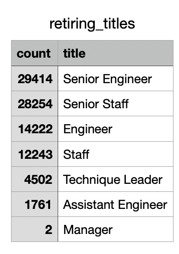

# Pewlett-Hackard-Analysis-
Employee SQL Database

## Resources

departments.csv 

dept_emp.csv 

dept_manager.csv 

employees.csv 

salaries.csv 

titles.csv
____
- SQL
- pgAdmin

# Overview of the Analysis:
The purpose of the analysis was to practice my SQL queries to determine the number of retiring employees per title, and identify employees who are eligible to participate in a mentorship program. This analysis will help the company Pewlett Hackard prepare for the large amount of employees on the verge of retirement and to establish a mentorship program while the employees are still there.

## Part 1 The Number of Retiring Employees by Title
Some of the concepts demonstrated in this section were creating new tables with the INTO statement, exporting a table as a CSV file, filtering queries with the WHERE clause, using the INNER JOIN clause to join two tables on a primary key, and using the GROUPBY() DISTINCT ON () ORDER BY () COUNT() functions. The first csv that is exported is a list of the current employees that will likely be retiring soon alongside their titles.

### Retirement Titles
The table shows the employees that are in the age range for retirement and the titles that they have had attached to the employee number key.
__________

### Current Retirement Titles
The table is comprised of the employees with their current role at the company organized with GROUP BY() and ORDER BY().
__________

### Retirement Title Total
The table has the current number of titles filled by employees who are retiring.
__________

## Part 2 The Employees Eligible for the Mentorship Program
The goal for the completion of the table was to create a mentorship-eligibility table that holds the current employees who were born between January 1, 1965 and December 31, 1965. The queries used to retrieve and order the data include all of the same functions covered in part 1. 
__________

# Summary:
The results from the analysis of the database shows that the there is nearly 60,000 senior employees close to retiring. This could cause the company a lot of problems if they were not prepared for the mass retirement of 90,398 of their employees. The problem looks bad at first but when you look at the count of employees there are 1,549 employees in the eligible for the mentoship program.  The list of employees retiring will help in understanding in which departments there is going to be more vacancy that will need to be adressed with hiring. Below we see the counts for the Mentorship and retirement to show the disparity caused by retirement.

### Mentorship Program Count
__________
- This table shows the current positions of the employees elgible for the mentorship program.

### Mentorship Count by Department
__________
- Below the Count for each department is shown for all people that are elgible for mentorship.

### Retirement Count by Department
__________
- The final table shows the amount of employees retiring by department.

